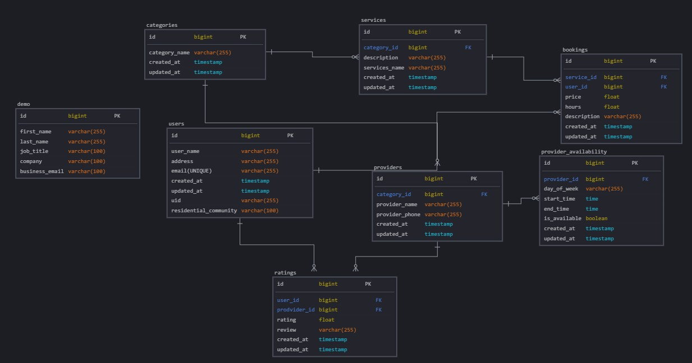

# Tralli🛠️ 🧰

## Overview

Tralli is a platform that connects users, especially developers, with trade
companies offering job services related to building maintenance, apartment
repairs, condo improvements, and townhome fixes. The platform serves as a bridge
between skilled trade professionals and property owners, making it easier to
find reliable services for various construction and repair needs

### Problem Space

Many developers and property owners struggle to find trustworthy trade
professionals for repairs and maintenance. The process is often time-consuming
and lacks transparency in pricing, service quality, and availability. Tralli
aims to simplify this by providing a centralized platform where users can
browse, compare, and hire skilled trade professionals efficiently.

### User Profile

**Developers**: Individuals who own or manage properties and require trade
services for maintenance, repairs, and improvements.

- How they use the app:
  - Compare service providers based on reviews, pricing, and availability
  - Book appointments and track service progress
  - Rate and review service providers
- Special Considerations:
  - Need reliable, licensed professionals with transparent pricing
  - Require easy scheduling and automated invoicing for services
  - Prefer integration with existing property management tools

**Business Owners**: Companies that provide trade services and want to reach a
broader audience of property owners.

- How they use the app:
  - List services and pricing
  - Manage appointments and track service progress
  - Receive ratings and reviews from customers
- Special Considerations:
  - Need a platform to showcase services and attract new customers
  - Require a scheduling system to manage appointments efficiently
  - Prefer integration with existing business management tools

### Features

- As a user I want to book a demo
- As a user I want to sign up, I want to create an account to access the platform.
- As a user I want to log in, I want to access the platform with my account.
- As a user I want to be able to sign up with Google, I want to use
  third-party authentication.
- As a user I want to view service categories, I want to browse available
  services based on categories.

## Implementation

### Tech Stack

- Mockups: Figma
- **Frontend**:⚛️ React, SCSS, HTML, JavaScript,

  - Client libraries:
    - react
    - react-router-dom
    - axios
    - firebase

- **Backend**: 🌿 Node.js, Express,🐬 MySQL
  - Server libraries:
    - express
    - cors
    - dotenv
    - mysql2

### APIs

List any external sources of data that will be used in your app.

- Google Maps API
- Mapbox API : mapping and distance calculation services
- SendGrid API: email confirmation and notifications
- Stripe API: payment processing for service fees
- Google OAuth API (Google Identity Platform): user authentication
- Facebook Login API (Meta for Developers): user authentication

### Sitemap

- Home Page
  - Sign Up
  - Log In
  - Book a Demo
- User Profile
  - Account Details
  - Payment Information
  - Service History
- Service Page
  - Service Categories
  - Search and Filter Options
- Issues Page
  - Issue List
  - Book Service

### Mockups

- Home Page: Landing page with a brief description of the platform, book a demo
  and a call to action to sign up or log in.
  
- Demo page: User can book a demo
  
- Sign Up Page: Registration form for new users to create an account, or can use
  Google, facebook account as a third-party authentication.
  

- Service Page: List of available services categories with search and filter
  options. 

### Data

### Endpoints

- **GET** `/`:Home page
- **GET** `/signup`:Show Sign up page
- **POST** `/signup`:Register a new user
- **GET** `/categories?fullName=fullName&residentialCom=residentialCom`:categories page when user signed in
- **GET** `/categories/:id/services`:List of services from specific category

## Roadmap

- Create client

  - react project with routes and boilerplate pages

- Create server

  - express project with routing, with placeholder 200 responses

- Create models
  - create models for users, services, issues, and bookings, demo, categories, ratings, provider_availability

- Create controllers

  - create controllers for users, services, issues, and bookings

- Create routes
  - create routes for users, services, issues, and bookings

## Future Implementations

###Endpoints
- **GET** `/services/:id`:Service details
- **GET** `/issues`:List of issues
- **POST** `/issues/:id`:Issue details, payment, and booking

###Pages 
- Profile Page: User profile with account details, payment information.
  

- Issues Page: List of issues from a specific service category where user can
  choose the issue and book a service.
  

### Features
- As a logged in user I want to find a trade professional, I want to be able to
  search for services based on location, service type, and availability.
- As a logged in user I want to book a service, I want to be able to view
  service providers' profiles, reviews, and pricing.
- As a logged in user I want to track service progress, I want to receive
  notifications and updates on service appointments.
- As a logged in user I want to rate and review a service, I want to provide
  feedback on the quality of service received.
- As a logged in user I want to manage my account, I want to view my service
  history and manage my profile.

- As a business owner I want to list my services, I want to showcase my
  services, pricing, and availability.
- As a business owner I want to manage appointments, I want to view and manage
  service appointments and track service progress.
- As a business owner I want to receive ratings and reviews, I want to receive
  feedback from customers and improve my services.
- Implement Google Maps API for location-based services
- Implement Mapbox API for mapping and distance calculation services
- Implement SendGrid API for email confirmation and notifications
- Implement Stripe API for payment processing for service fees
- Implement Google OAuth API for user authentication
- Implement Facebook Login API for user authentication
- Implement user roles and permissions for business owners and users
- Implement a scheduling system for managing service appointments
- Implement a rating and review system for service providers
